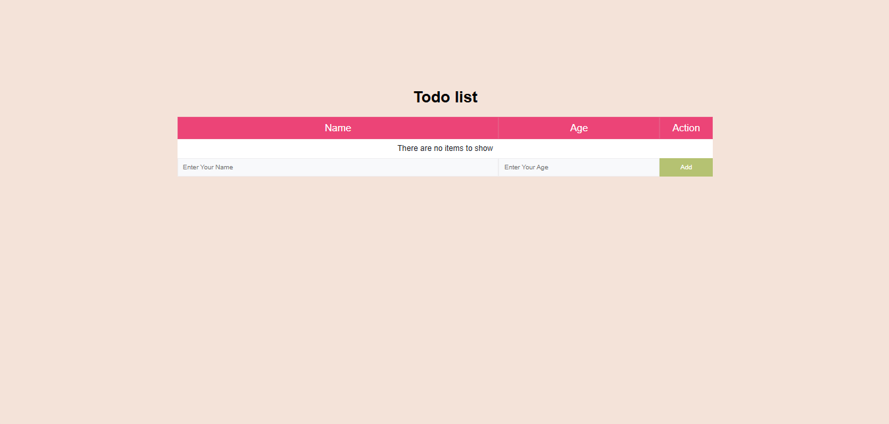

# Todo List Application

This is a simple Todo List application built with ReactJs [class-component]. It allows users to add and delete todo items. The application uses class components for state management and rendering.

## Table of contents

- [Overview](#overview)
- [Features](#Features)
- [Components](#Components)
  - [App](#App)
  - [TodoItems](#TodoItems)
  - [Additems](#Additems)
- [Installation](#Installation)
- [Usage](#Usage)
- [Links](#Links)
  - [Screenshot](#Screenshot)
  - [What I learned](#what-i-learned)
  - [Continued development](#continued-development)
- [Author](#author)
- [Acknowledgments](#Acknowledgments)


## overview
This project is a simple Todo List application built with React.js. It demonstrates the use of class components, state management, and component composition in React. The application allows users to add and remove tasks, providing a straightforward way to manage daily activities. It serves as an excellent example for those looking to understand and implement React.js concepts in their projects.

## Features
- Add new todo items
- Delete existing todo items


## Components

### App

The main component that holds the state and renders the TodoItems and Additems components.

### TodoItems

Displays the list of todo items and provides an option to delete them.

### Additems

Contains a form to add new todo items


## Installation
To get started with this project, follow these steps:

you can clone the project or download it as Zip file.
1. Clone the repository:
   ```bash
   git clone <repository-url>

2. Navigate to the project directory:
   cd <project-directory>

3. Install the required dependencies:
   npm install   


## Usage
To run the application, use the following command:

npm start


## Links

If you want to open the link in a new tab, you can:

- Press **Ctrl** (or **Cmd** on Mac) while clicking the link.
- Right-click the link and select **Open link in new tab**.

Otherwise, all links will open in the same tab.


- Solution URL: [here](https://github.com/olahasan/Todo-List-_React-Project_class-component/tree/main)

- Live Site URL: [here](https://simple-todo-list-app-classes.surge.sh/)

 ## Screenshot
 



## what-i-learned
Through this project, I learned in this simple project how to create react app and treat with calss component,
how to add and delete item and how to deploy it on Surge.sh

## Continued Development
In the future, I plan to:
- learn reactJs Hooks.

### Author

GitHub - @olahasan

### Acknowledgments

I would like to thank the **[unique coderz academy](https://www.youtube.com/@UniqueCoderzAcademy)** for providing this challenge and to the community for their support.

